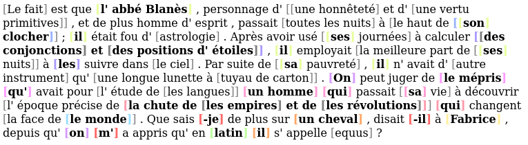
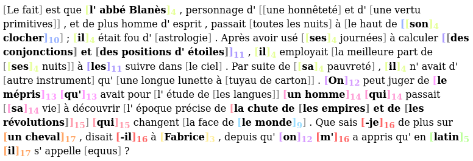
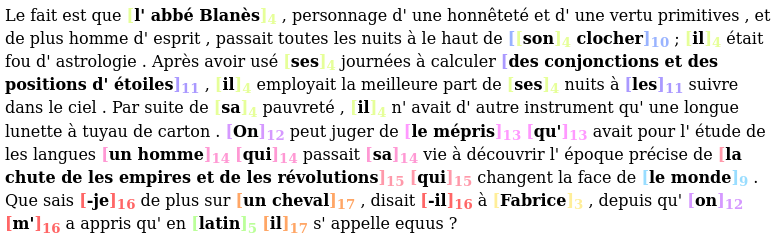
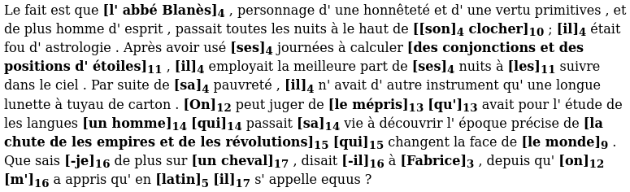
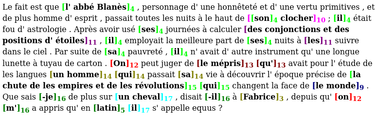

# Conversion Scripts for Coreference

This repository contains conversion scripts for coreference.  The main formats we are dealing with here are described at the end of this document.


## The `jsonlines2text.py` script

Script to convert from a jsonlines file to a text representation of coreference annotation.  The output is html.  Mentions are surrounded by brackets.  Coreference chains are represented by colors (each chain has a specific color) and, if requested by a switch, an index (1, 2, 3...).  Singletons may be hidden or shown in a specific color (gray by default), without any index.

If your jsonlines file contains several documents, you may show the document name by using the `--heading` option.

In any case, use the `-h` and `--help` switches to get a detailed list of options.

Here are some example (command then illustration):

(1) Color without index:

```bash
python3 jsonlines2text.py testing/docs.jsonlines -o output.html
```



(2) Color with index:

```bash
python3 jsonlines2text.py testing/docs.jsonlines -i -o output.html
```



(Note: indices don't start at 1 in the image becaue it's not the
beginning of the text.)

(3) Hide singletons:

```bash
python3 jsonlines2text.py testing/docs.jsonlines -i -o output.html --sing-color ""
```



(4) No color (`cm` stands for `color manager`):

```bash
python3 jsonlines2text.py testing/docs.jsonlines -i -o output.html --sing-color "" --cm ""
```



(5) Using common html colors (more constrast, but fewer available colors, so several chains may have the same color):

```bash
python3 jsonlines2text.py testing/docs.jsonlines -i -o output.html --sing-color "" --cm "common"
```



(6) Limiting the output to the N first tokens:

```bash
python3 jsonlines2text.py testing/docs.jsonlines -i -o output.html -n 100
```


## The `jsonlines2conll.py` script

Script to convert a jsonlines file to a CoNLL file.  Use the `-h` and `--help` switches to get detailed help on the options.

Example command (output uses spaces):

```bash
python3 jsonlines2conll.py -g testing/singe.jsonlines -o ouput.conll
```

```
#begin document (ge/articleswiki_singe.xml); part 000
Singe   (0)

         Les         (0
      singes         0)
        sont          -
         des         (0
  mammifères          -
          de          -
          l'         (1
       ordre          -
         des          -
          de          -
         les         (2
    primates      1)|2)
...
#end document
```

Example command (merging coreference information with an existing conll file, for example to add predicted coreference):

```bash
python3 jsonlines2conll.py -g testing/singe.jsonlines -o ouput.conll -c testing/singe.conll
```

```
#begin document (ge/articleswiki_singe.xml); part 000
1   Singe   Singe   NOUN   ...

   1            Les             le     DET   ...
   2         singes          singe    NOUN   ...
   3           sont           être     AUX   ...
   4            des             un     DET   ...
   5     mammifères      mammifère    NOUN   ...
   6             de             de     ADP   ...
   7             l'             le     DET   ...
   8          ordre          ordre    NOUN   ...
9-10            des              _       _   ...
   9             de             de     ADP   ...
  10            les             le     DET   ...
  11       primates        primate    NOUN   ...
...
#end document
```

Example command (merging + output uses tabulation):

```bash
python3 jsonlines2conll.py -g testing/singe.jsonlines -o ouput.conll -c testing/singe.conll -T
```


## The `conll2jsonlines.py` script

Script to convert a conll formatted file to a jsonlines formatted file.  Use the `-h` and `--help` switches to get detailed help on the options.

For example, to convert from the original CoNLL2012 format into jsonlines format:

```bash
python3 conll2jsonlines.py \
  --token-col 3 \
  --speaker-col 9 \
  INPUT_FILE \
  OUTPUT_FILE
```

To convert from the StanfordNLP format into jsonlines format:

```bash
python3 conll2jsonlines.py \
  --skip-singletons \
  --skip-empty-documents \
  --tab \
  --ignore-double-indices 0 \
  --token-col 1 \
  --speaker-col "_" \
  --no-coref \
  INPUT_FILE \
  OUTPUT_FILE
```

To convert from the Democrat corpus in CoNLL format (with a column for paragraphs at position 11):

```bash
python3 conll2jsonlines.py \
  --tab \
  --ignore-double-indices 0 \
  --token-col 1 \
  --speaker-col "_" \
  --par-col 11 \
  testing/singe.conll \
  testing/singe.jsonlines
```

Note that you may have to change document keys in the CoNLL files before running this script if you want to transform them.

Output sample:

```
{
   "doc_key": "(ge/articleswiki_singe.xml); part 000",
   "clusters": [[[0, 0], [1, 2], [4, 12]], [[7, 12]], [[11, 12]]],
   "sentences": [["Singe"],
                 ["Les", "singes", "sont", "des", "mammif\u00e8res", "de",
                  "l'", "ordre", "des", "de", "les", "primates", "."]],
   "speakers": [["_"],
                ["_", "_", "_", "_", "_", "_",
                 "_", "_", "_", "_", "_", "_", "_"]],
   "paragraphs": [[0, 0], [1, 13]]
}
```

## The `sacr2conll.py` script

Script to convert from the [SACR](https://boberle.com/projects/coreference-annotation-with-sacr/) format to a CONLL-2012-like format.  Note that the CONLL format which is produced:

- contains 3 columns (not all the columns of the original CONLL-2012 format):
   - index
   - form
   - coreference
- is tabulation separated (like CONLL-X, while the original CONLL-2012 format is space separated).

Here is the command to convert the SACR files in the `testing` directory:

```bash
python3 sacr2conll.py -o testing/testing_sacr2conll.conll testing/*.sacr
```

This will produce a `testing/testing_sacr2conll.conll` file which contains all the input files specified on the command line converted into a CONLL-like format.

Here is an extract:

```
#begin document (aesop.sacr); part 000
0	A	(0
1	Peasant	0)
2	found	-
3	an	(1
4	Eagle	-
5	captured	-
6	in	-
7	a	(2
8	trap	2)_1)
...
#end document


#begin document (ceasar.sacr); part 000
0	Gaius	(0
1	Julius	-
2	Caesar	0)
3	(	-
4	12	(1
5	or	-
6	13	-
7	July	-
8	100	-
9	BC	1)
10	–	-
11	15	(2
12	March	-
13	44	-
14	BC	2)
15	)	-
16	,	-
17	known	-
18	by	-
19	his	(3_(4_(0)
20	nomen	4)
21	and	-
22	cognomen	(5)
23	Julius	-
24	Caesar	3)
...
```

Please refer to the `-h` option for a complete list of options.


With the `--speaker` switch, you can add a 4th column, which will be placed before the coreference columns.  In the SACR file, the speaker can be mentionned as a comment prefixed with `#speaker:` before each line, like this:

    #title: Lucian, Dialogues of the Dead, 4: Hermes and Charon

    #speaker: Hermes
    Ferryman, what do you say to settling up accounts? It will prevent any
    unpleasantness later on.

    #speaker: Charon
    Very good. It does save trouble to get these things straight.

This will produce a CoNLL file like this:

```
#begin document (lucian_speakers.sacr); part 000
0	Ferryman	Hermes	-
1	,	Hermes	-
2	what	Hermes	-
3	do	Hermes	-
4	you	Hermes	-
5	say	Hermes	-
6	to	Hermes	-
7	settling	Hermes	-
8	up	Hermes	-
9	accounts	Hermes	-
10	?	Hermes	-

0	It	Hermes	-
1	will	Hermes	-
2	prevent	Hermes	-
3	any	Hermes	-
4	unpleasantness	Hermes	-
5	later	Hermes	-
6	on	Hermes	-
7	.	Hermes	-

0	Very	Charon	-
1	good	Charon	-
2	.	Charon	-
```

You can remove the speaker for a paragraph by setting:

    #speaker:
    ... the text of the narrator ...

A test file is available in `testing/lucian_speakers.sacr`.

To convert a SACR file to a jsonline file, you will need to run these two commands:

```bash
python3 sacr2conll.py -s -o /tmp/lucian_speakers.conll testing/lucian_speakers.sacr
python3 conll2jsonlines.py --token-col 1 --speaker-col 2 /tmp/lucian_speakers.conll /tmp/lucian_speakers.jsonlines
```


## The `conll2sacr.py` script

The opposite of `sacr2conll.py`.  It converts a CONLL-2012 or CONLL-X file into a [SACR](https://boberle.com/projects/coreference-annotation-with-sacr/) file.

The script take an output directory as parameter: all documents in the CONLL file will be output as a different file in this directory.

Here is the command to convert back the SACR files converted to CONLL in the previous section:

```
python3 conll2sacr.py \
   --output-dir testing_conll2sacr \
   --tab \
   --token-col 1 \
   testing/testing_sacr2conll.conll
```

Note the `--tab` option (because here the CONLL file is tab separated) and the `--token-col` option which indicates that the tokens are to be found in the second column (index starts at 0).

If you were to parse a real CONLL-2012 (the original format), you would have to drop the `--tab` option (because the original format is space (not tab) spearated) and the `--token-col` option (or set it to 3, which is the default).

The command produced a series of files in the `testing_conll2sacr` directory:

```
_aesop.sacr___part_000
_ceasar.sacr___part_000
_cicero.sacr___part_000
_pliny.sacr___part_000
_simple.sacr___part_000
```

Note that special characters (here the parentheses and spaces) have been replaced by underscores.

Please refer to the `-h` option for a complete list of options.


## `text2jsonlines.py`

Script to convert a plain text to a jsonlines format (used for example for [cofr](https://github.com/boberle/cofr)).

It tokenizes the text with [StanfordNLP](https://github.com/stanfordnlp/stanfordnlp).  You need to install StanfordNLP via pip and then load the models, for example for French models (use "en" for English models):

```bash
python3 -c "import stanfordnlp; stanfordnlp.download('fr')"
```

Notes:

- the doc key is the concatenation of `--genre` and the file path,
- speaker data are left blank ("_")

Usage:

```
python3 text2jsonlines.py <plain.txt> -o <output.jsonlines>
```

Choose the language with the `--lang` option (`en` by default, use `fr` for French).

Example with the sentence "I eat an apple.":

```
{
   "doc_key": "ge:input.txt",
   "sentences": [["I", "eat", "an", "apple", "."]],
   "speakers": [["_", "_", "_", "_", "_"]],
   "clusters": [],
   "pos": [["PRON", "VERB", "DET", "NOUN", "PUNCT"]],
   "paragraphs": [[0, 4]]
}
```


## `jsonlines2tei.py`

Script to convert the jsonlines format into a TEI-URS format used by softwares such as TXM.  See the [`jsonlines2tei` repository](https://github.com/boberle/jsonlines2tei).


## Function library `conll_transform.py`

Module containing several function to manipulate conll data:

- `read_files`: Read one or several conll files and return a dictionary of documents.
- `read_file`: Read a conll file and return dictionary of documents.
- `write_file`: Write a conll file.
- `compute_mentions`: Compute mentions from the raw last column of the conll file.
- `compute_chains`: Compute and return the chains from the conll data.
- `sentpos2textpos`: Transform mentions `[SENT, START, STOP]` to `[TEXT_START, TEXT_STOP]`.
- `textpos2sentpos`: Transform mentions `[TEXT_START, TEXT_STOP]` to `[SENT, START, STOP]`.
- `write_chains`: Convert a list of chains to a conll coreference column.
- `replace_coref_col`: Replace the last column of `tar_docs` by the last column of `src_docs`.
- `remove_singletons`: Remove the singletons of the conll file `infpath`, and write the version without singleton in the conll file `outfpath`.
- `filter_pos`: Filter mentions that have POS in unwanted_pos, return a new mention list.
- `check_no_duplicate_mentions`: Return True if there is no duplicate mentions.
- `merge_boundaries`: Add the mentions of `boundary_docs` to `coref_docs` if they don't already exist, as singletons.
- `remove_col`: Remove columns from all tokens in docs.
- `write_mentions`: Opposite for `compute_mentions()`.  Write the last column in `sent`.
- `compare_coref_cols`: Build a conll file that merge the corefcols of several other files.
- `to_corefcol`: Write the conll file `outfpath` with just the last column (coref) of the conll file `infpath`.
- `get_conll_2012_key_pattern`: Return a compiled pattern object to match conll2012 key format.
- `merge_amalgams`: Add amalgams in documents from where they have been removed.


## Main formats used in automatic coreference resolution

The **CoNLL format** is a tabular format: each token is on a separate line and annotation for the token are on separate column.  Document boundaries are indicated by specific marks, and sentence separation by a white line.

Here is an example:

```
#begin document <name of the document>
1            Les             le     DET
2         singes          singe    NOUN
3           sont           être     AUX
4            des             un     DET
5     mammifères      mammifère    NOUN
...

1           Bien           bien     ADV
2            que            que   SCONJ
3           leur            son     DET
4   ressemblance   ressemblance    NOUN
5           avec           avec     ADP
6             l'             le     DET
7          Homme          homme    NOUN
...
#end document
```

Column separator (spaces or tabulation), number and content vary according to specification (CoNLL-2012, CoNLL-U, CoNLL-X, etc.).


The **jsonlines format** stores data for several texts (a corpus).  Each line is a valid json document, as follows:

```
{
  "clusters": [],
  "doc_key": "nw:docname",
  "sentences": [["This", "is", "the", "first", "sentence", "."],
                ["This", "is", "the", "second", "."]],
  "speakers":  [["spk1", "spk1", "spk1", "spk1", "spk1", "spk1"],
                ["spk2", "spk2", "spk2", "spk2", "spk2"]]
  "pos":       [["DET", "V", "DET", "ADJ", "NOUN", "PUNCT"],
                ["DET", "V", "DET", "ADJ", "PUNCT"]],
  ...
}
```

It is used for some coreference resolution systems, such as:

- https://github.com/kentonl/e2e-coref (English)
- https://github.com/kkjawz/coref-ee (English)
- https://github.com/boberle/cofr (French)


## License

All the scripts are distributed under the terms of the Mozilla Public Licence 2.0.
