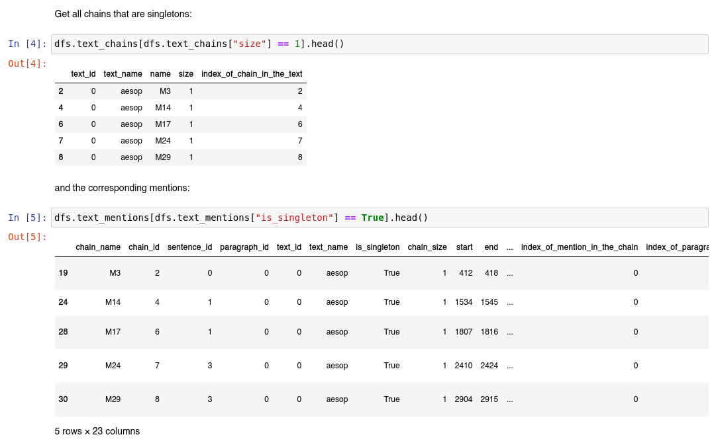
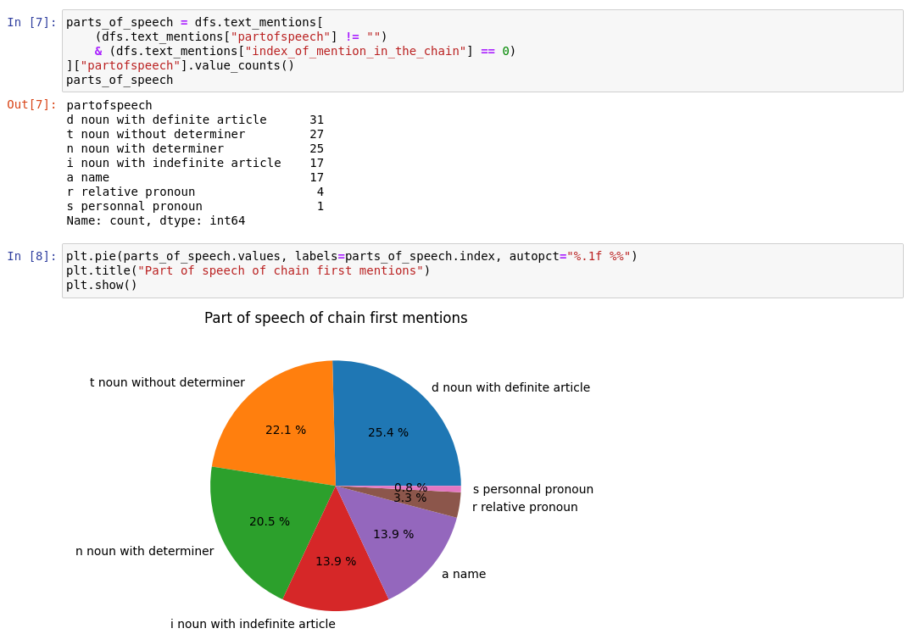
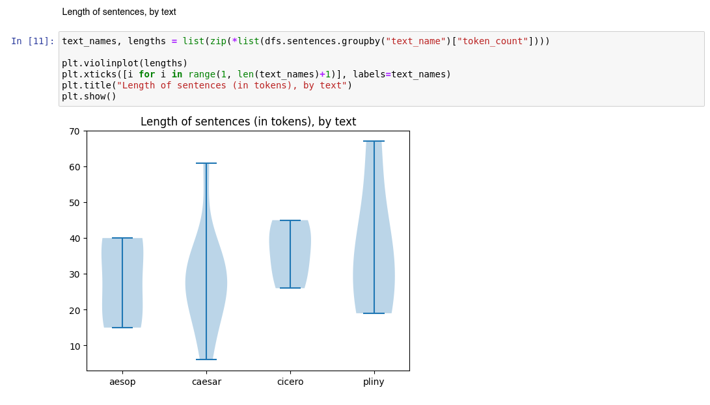
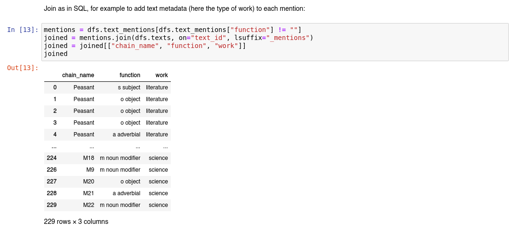
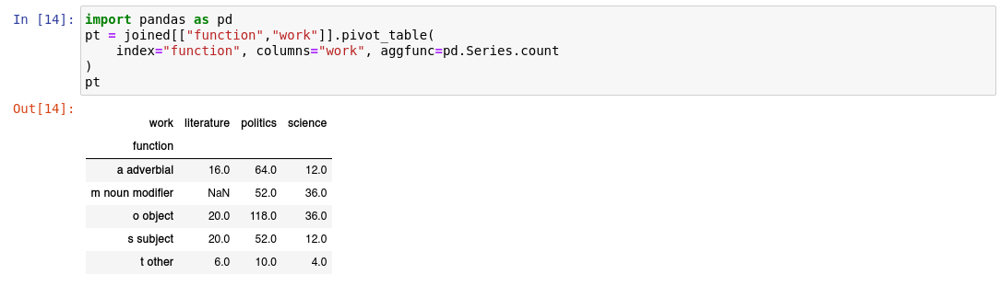
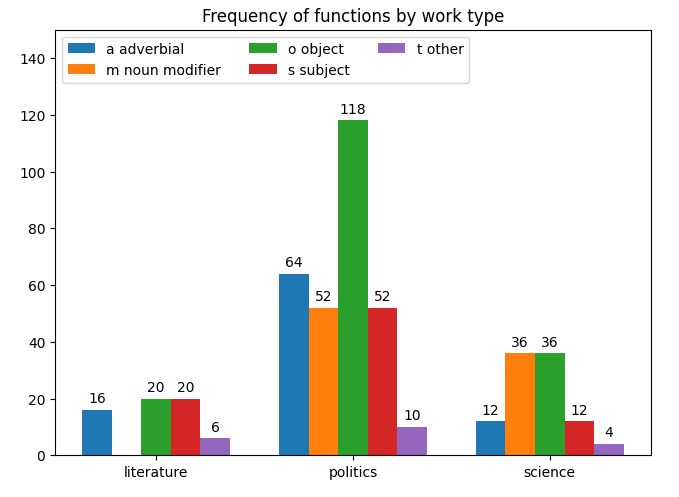
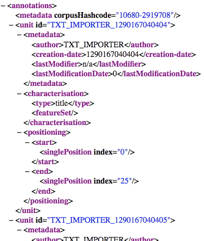

# Conversion Scripts for Coreference

This repository contains conversion scripts for coreference.

Here is a "table of contents":

- conversion between 2 formats:
  - [jsonlines2conll](#jsonlines2conll) and [conll2jsonlines](#conll2jsonlines)
  - [sacr2conll](#sacr2conll) and [conll2sacr](#conll2sacr)
  - [text2jsonlines](#text2jsonlines) and [jsonlines2text](#jsonlines2text)
  - [sacr2ann](#sacr2ann)
  - [sacr2glozz](#sacr2glozz) and [glozz2sacr](#glozz2sacr)
  - [jsonlines2tei](#jsonlines2tei)
- analysis with Pandas/relational database and Matplotlib:
  - [corpus of sacr files as dataframes and relational databases](#sacr2df)
- tools and references:
  - [functions for CoNLL](#conll-transform)
  - [main formats used in coreference](#main-formats)
- on the repository:
  - [code quality](#quality)
  - [license and contact](#license)


## <a name="jsonlines2text"></a> The `jsonlines2text.py` script

Script to convert from a jsonlines file to a text representation of coreference annotation.  The output is html.  Mentions are surrounded by brackets.  Coreference chains are represented by colors (each chain has a specific color) and, if requested by a switch, an index (1, 2, 3...).  Singletons may be hidden or shown in a specific color (gray by default), without any index.

If your jsonlines file contains several documents, you may show the document name by using the `--heading` option.

In any case, use the `-h` and `--help` switches to get a detailed list of options.

Here are some example (command then illustration):

(1) Color without index:

```bash
python3 jsonlines2text.py testing/docs.jsonlines -o output.html
```


(2) Color with index:

```bash
python3 jsonlines2text.py testing/docs.jsonlines -i -o output.html
```


(Note: indices don't start at 1 in the image becaue it's not the
beginning of the text.)

(3) Hide singletons:

```bash
python3 jsonlines2text.py testing/docs.jsonlines -i -o output.html --sing-color ""
```


(4) No color (`cm` stands for `color manager`):

```bash
python3 jsonlines2text.py testing/docs.jsonlines -i -o output.html --sing-color "" --cm ""
```


(5) Using common html colors (more constrast, but fewer available colors, so several chains may have the same color):

```bash
python3 jsonlines2text.py testing/docs.jsonlines -i -o output.html --sing-color "" --cm "common"
```


(6) Limiting the output to the N first tokens:

```bash
python3 jsonlines2text.py testing/docs.jsonlines -i -o output.html -n 100
```


## <a name="jsonlines2conll"></a> The `jsonlines2conll.py` script

Script to convert a jsonlines file to a CoNLL file.  Use the `-h` and `--help` switches to get detailed help on the options.

Example command (output uses spaces):

```bash
python3 jsonlines2conll.py -g testing/singe.jsonlines -o ouput.conll
```

```
#begin document (ge/articleswiki_singe.xml); part 000
Singe   (0)

         Les         (0
      singes         0)
        sont          -
         des         (0
  mammifères          -
          de          -
          l'         (1
       ordre          -
         des          -
          de          -
         les         (2
    primates      1)|2)
...
#end document
```

Example command (merging coreference information with an existing conll file, for example to add predicted coreference):

```bash
python3 jsonlines2conll.py -g testing/singe.jsonlines -o ouput.conll -c testing/singe.conll
```

```
#begin document (ge/articleswiki_singe.xml); part 000
1   Singe   Singe   NOUN   ...

   1            Les             le     DET   ...
   2         singes          singe    NOUN   ...
   3           sont           être     AUX   ...
   4            des             un     DET   ...
   5     mammifères      mammifère    NOUN   ...
   6             de             de     ADP   ...
   7             l'             le     DET   ...
   8          ordre          ordre    NOUN   ...
9-10            des              _       _   ...
   9             de             de     ADP   ...
  10            les             le     DET   ...
  11       primates        primate    NOUN   ...
...
#end document
```

Example command (merging + output uses tabulation):

```bash
python3 jsonlines2conll.py -g testing/singe.jsonlines -o ouput.conll -c testing/singe.conll -T
```


## <a name="conll2jsonlines"></a> The `conll2jsonlines.py` script

Script to convert a conll formatted file to a jsonlines formatted file.  Use the `-h` and `--help` switches to get detailed help on the options.

For example, to convert from the original CoNLL2012 format into jsonlines format:

```bash
python3 conll2jsonlines.py \
  --token-col 3 \
  --speaker-col 9 \
  INPUT_FILE \
  OUTPUT_FILE
```

To convert from the StanfordNLP format into jsonlines format:

```bash
python3 conll2jsonlines.py \
  --skip-singletons \
  --skip-empty-documents \
  --tab \
  --ignore-double-indices 0 \
  --token-col 1 \
  --speaker-col "_" \
  --no-coref \
  INPUT_FILE \
  OUTPUT_FILE
```

To convert from the Democrat corpus in CoNLL format (with a column for paragraphs at position 11):

```bash
python3 conll2jsonlines.py \
  --tab \
  --ignore-double-indices 0 \
  --token-col 1 \
  --speaker-col "_" \
  --par-col 11 \
  testing/singe.conll \
  testing/singe.jsonlines
```

Note that you may have to change document keys in the CoNLL files before running this script if you want to transform them.

Output sample:

```
{
   "doc_key": "(ge/articleswiki_singe.xml); part 000",
   "clusters": [[[0, 0], [1, 2], [4, 12]], [[7, 12]], [[11, 12]]],
   "sentences": [["Singe"],
                 ["Les", "singes", "sont", "des", "mammif\u00e8res", "de",
                  "l'", "ordre", "des", "de", "les", "primates", "."]],
   "speakers": [["_"],
                ["_", "_", "_", "_", "_", "_",
                 "_", "_", "_", "_", "_", "_", "_"]],
   "paragraphs": [[0, 0], [1, 13]]
}
```

## <a name="sacr2conll"></a> The `sacr2conll.py` script

Script to convert from the [SACR](https://boberle.com/projects/coreference-annotation-with-sacr/) format to a CONLL-2012-like format.  Note that the CONLL format which is produced:

- contains 3 columns (not all the columns of the original CONLL-2012 format):
   - index
   - form
   - coreference
- is tabulation separated (like CONLL-X, while the original CONLL-2012 format is space separated).

Here is the command to convert the SACR files in the `testing` directory:

```bash
python3 sacr2conll.py -o testing/testing_sacr2conll.conll testing/*.sacr
```

This will produce a `testing/testing_sacr2conll.conll` file which contains all the input files specified on the command line converted into a CONLL-like format.

Here is an extract:

```
#begin document (aesop.sacr); part 000
0	A	(0
1	Peasant	0)
2	found	-
3	an	(1
4	Eagle	-
5	captured	-
6	in	-
7	a	(2
8	trap	2)_1)
...
#end document


#begin document (caesar.sacr); part 000
0	Gaius	(0
1	Julius	-
2	Caesar	0)
3	(	-
4	12	(1
5	or	-
6	13	-
7	July	-
8	100	-
9	BC	1)
10	–	-
11	15	(2
12	March	-
13	44	-
14	BC	2)
15	)	-
16	,	-
17	known	-
18	by	-
19	his	(3_(4_(0)
20	nomen	4)
21	and	-
22	cognomen	(5)
23	Julius	-
24	Caesar	3)
...
```

Please refer to the `-h` option for a complete list of options.


With the `--speaker` switch, you can add a 4th column, which will be placed before the coreference columns.  In the SACR file, the speaker can be mentionned as a comment prefixed with `#speaker:` before each line, like this:

    #title: Lucian, Dialogues of the Dead, 4: Hermes and Charon

    #speaker: Hermes
    Ferryman, what do you say to settling up accounts? It will prevent any
    unpleasantness later on.

    #speaker: Charon
    Very good. It does save trouble to get these things straight.

This will produce a CoNLL file like this:

```
#begin document (lucian_speakers.sacr); part 000
0	Ferryman	Hermes	-
1	,	Hermes	-
2	what	Hermes	-
3	do	Hermes	-
4	you	Hermes	-
5	say	Hermes	-
6	to	Hermes	-
7	settling	Hermes	-
8	up	Hermes	-
9	accounts	Hermes	-
10	?	Hermes	-

0	It	Hermes	-
1	will	Hermes	-
2	prevent	Hermes	-
3	any	Hermes	-
4	unpleasantness	Hermes	-
5	later	Hermes	-
6	on	Hermes	-
7	.	Hermes	-

0	Very	Charon	-
1	good	Charon	-
2	.	Charon	-
```

You can remove the speaker for a paragraph by setting:

    #speaker:
    ... the text of the narrator ...

A test file is available in `testing/lucian_speakers.sacr`.

To convert a SACR file to a jsonline file, you will need to run these two commands:

```bash
python3 sacr2conll.py -s -o /tmp/lucian_speakers.conll testing/lucian_speakers.sacr
python3 conll2jsonlines.py --token-col 1 --speaker-col 2 /tmp/lucian_speakers.conll /tmp/lucian_speakers.jsonlines
```


## <a name="conll2sacr"></a> The `conll2sacr.py` script

The opposite of `sacr2conll.py`.  It converts a CONLL-2012 or CONLL-X file into a [SACR](https://boberle.com/projects/coreference-annotation-with-sacr/) file.

The script take an output directory as parameter: all documents in the CONLL file will be output as a different file in this directory.

Here is the command to convert back the SACR files converted to CONLL in the previous section:

```
python3 conll2sacr.py \
   --output-dir testing_conll2sacr \
   --tab \
   --token-col 1 \
   testing/testing_sacr2conll.conll
```

Note the `--tab` option (because here the CONLL file is tab separated) and the `--token-col` option which indicates that the tokens are to be found in the second column (index starts at 0).

If you were to parse a real CONLL-2012 (the original format), you would have to drop the `--tab` option (because the original format is space (not tab) spearated) and the `--token-col` option (or set it to 3, which is the default).

The command produced a series of files in the `testing_conll2sacr` directory:

```
_aesop.sacr___part_000
_caesar.sacr___part_000
_cicero.sacr___part_000
_pliny.sacr___part_000
_simple.sacr___part_000
```

Note that special characters (here the parentheses and spaces) have been replaced by underscores.

Please refer to the `-h` option for a complete list of options.


## <a name="text2jsonlines"></a> `text2jsonlines.py`

Script to convert a plain text to a jsonlines format (used for example for [cofr](https://github.com/boberle/cofr)).

It tokenizes the text with [StanfordNLP](https://github.com/stanfordnlp/stanfordnlp).  You need to install StanfordNLP via pip and then load the models, for example for French models (use "en" for English models):

```bash
python3 -c "import stanfordnlp; stanfordnlp.download('fr')"
```

Notes:

- the doc key is the concatenation of `--genre` and the file path,
- speaker data are left blank ("_")

Usage:

```
python3 text2jsonlines.py <plain.txt> -o <output.jsonlines>
```

Choose the language with the `--lang` option (`en` by default, use `fr` for French).

Example with the sentence "I eat an apple.":

```
{
   "doc_key": "ge:input.txt",
   "sentences": [["I", "eat", "an", "apple", "."]],
   "speakers": [["_", "_", "_", "_", "_"]],
   "clusters": [],
   "pos": [["PRON", "VERB", "DET", "NOUN", "PUNCT"]],
   "paragraphs": [[0, 4]]
}
```


## <a name="jsonlines2tei"></a> `jsonlines2tei.py`

Script to convert the jsonlines format into a TEI-URS format used by softwares such as TXM.  See the [`jsonlines2tei` repository](https://github.com/boberle/jsonlines2tei).


## <a name="conll-transform"></a> Function library `conll_transform.py`

Module containing several functions to manipulate conll data:

- `read_files`: Read one or several conll files and return a dictionary of documents.
- `read_file`: Read a conll file and return dictionary of documents.
- `write_file`: Write a conll file.
- `compute_mentions`: Compute mentions from the raw last column of the conll file.
- `compute_chains`: Compute and return the chains from the conll data.
- `sentpos2textpos`: Transform mentions `[SENT, START, STOP]` to `[TEXT_START, TEXT_STOP]`.
- `textpos2sentpos`: Transform mentions `[TEXT_START, TEXT_STOP]` to `[SENT, START, STOP]`.
- `write_chains`: Convert a list of chains to a conll coreference column.
- `replace_coref_col`: Replace the last column of `tar_docs` by the last column of `src_docs`.
- `remove_singletons`: Remove the singletons of the conll file `infpath`, and write the version without singleton in the conll file `outfpath`.
- `filter_pos`: Filter mentions that have POS in unwanted_pos, return a new mention list.
- `check_no_duplicate_mentions`: Return True if there is no duplicate mentions.
- `merge_boundaries`: Add the mentions of `boundary_docs` to `coref_docs` if they don't already exist, as singletons.
- `remove_col`: Remove columns from all tokens in docs.
- `write_mentions`: Opposite for `compute_mentions()`.  Write the last column in `sent`.
- `compare_coref_cols`: Build a conll file that merge the corefcols of several other files.
- `to_corefcol`: Write the conll file `outfpath` with just the last column (coref) of the conll file `infpath`.
- `get_conll_2012_key_pattern`: Return a compiled pattern object to match conll2012 key format.
- `merge_amalgams`: Add amalgams in documents from where they have been removed.


This module is available on PyPI. To download it:

```bash
pip3 install conll-transform
```

To use it, just import the functions from `conll_transform`, for example:

```python
from conll_transform import read_files

documents = read_files("myfile.conll", "myfile2.conll")
print(documents)
```


## <a name="sacr2ann"></a> Convert SACR file to Brat Standoff Annotation using `sacr2ann.py`

The script `sacr2ann.py` will convert a SACR file to a set of 2 files used with BRAT:

- a `.txt` file that holds the text (all comments found in the SACR file are ignored),
- and a `.ann` file that holds the annotations.

The format is described [here](https://brat.nlplab.org/standoff.html).

Only a subset of the BRAT annotations is taken into account for now, namely the text-bound anntoations (with a leading `T`), and the relation annotations (with a leading `R`).

The type of the text annotations is found in the `--type-property-name` of SACR annotations. This means that if your SACR schema holds a property `type` that contains the type of the annotation, and you want the type to be reflected in your BRAT annotation, then you would call `sacr2ann.py` with the option `--type-property-name type`.  If this option is not specify, or if a mention is missing, then the default type is `Mention`.

The type of the relation annotation is `Coreference`.

If you need more annotations from the BRAT format, don't hesitate to ask me by sending me message or opening an issue.

Here is an example.

Let's say you have the following SACR file `aesop.sacr`:

```
{Peasant:type="Person" A Peasant} found {Eagle:type="Animal" an Eagle captured in {M3:type="Object" a trap}},
and much admiring {Eagle:type="Animal" the bird}, set {Peasant:type="Person" him} free.
```

Then running:

```bash
python3 sacr2ann.py --type-property-name type aesop.sacr
```

will produce 2 files, `aesop.sacr.txt` and `aesop.sacr.ann`. You can specify the output files with the `--txt` and `--ann` options.

Here is the `.txt` file:

```
A Peasant found an Eagle captured in a trap,and much admiring the bird, set him free.
```

Here is the `.ann` file:

```
T1      Person 0 9      A Peasant
T2      Animal 16 43    an Eagle captured in a trap
T3      Object 37 43    a trap
T4      Animal 62 70    the bird
R1      Coreference Arg1:T2 Arg2:T4
T5      Person 76 79    him
R2      Coreference Arg1:T1 Arg2:T5
```

## <a name="sacr2df"></a> Pandas Dataframes and relational databases with `Annotable`, `sacr2annotable.py` and `sacr2df.py`

The `Annotable` class and its subclasses `Corpus`, `Text`, `Paragraph`, `Sentence`, `Token`, `Mention` and `Chain` are a great way to transform a corpus into a series of dataframes usable with Pandas.

The script `sacr2annotable.py` is a parser of SACR files into a `Corpus` object that can be used to convert into dataframes or CSV files.

The script `sacr2df.py` will take a series of SACR files as input, and output a zip file with CSV files, you can use it like this:

```bash
python3 sacr2df.py text1.sacr text2.sacr ... -o output_file.zip
```

You can also use it as a library, for example in a Jupyter notebook (see below for an example):

```python
from sacr2df import convert_sacr_files_to_dataframes
from pathlib import Path

dfs = convert_sacr_files_to_dataframes(
    Path("testing/aesop.sacr"),
    Path("testing/caesar.sacr"),
    Path("testing/cicero.sacr"),
    Path("testing/pliny.sacr"),
)

# then do something with the dfs:
print(dfs.texts.head())
print(dfs.paragraphs.head())
print(dfs.sentences.head())
print(dfs.tokens.head())
print(dfs.text_chains.head())
print(dfs.text_mentions.head())
print(dfs.text_consecutive_relations.head())
print(dfs.text_to_first_relations.head())
```

Each dataframe contains a series of columns containing index information (like the index of the mention in the chain), count information (chain size, token length), strings (the actual string of a mention or a token), metadata (properties for mentions, like part of speech or function, if they are annotated, metadata for texts, as anotated in the file), etc.  You will find the whole list below.

For mentions, properties are added as columns of the dataframe or CSV file. For example, with a mention like this:

```
{chain1:partofspeech="noun",function="subject" John} ...
```

2 columns will be added to the dataframe/csv: `partofspeech` and `function`.

You can add metadata to each text by adding them like this:

```
#textid:The Raven

#textmetadata:type=literature
#textmetadata:century=19
#textmetadata:author=Edgar Poe

Once upon a midnight dreary, while I pondered, weak and weary,
Over many a quaint and curious volume of forgotten lore, 
...
```

Here, the following columns will be added to the dataframe/csv of texts:

- `text_name`, containing here "The Raven"
- `type`, containing here "literature"
- `century`, containing here "19"
- `author`, containing here "Edgar Poe"

You can add as many metadata as you want. If a text is missing a metadata, `None` will be recorded.

The dataframes/csv files all have an index, which acts like an id. The dataframes are related by ids as in other relational database. For example, mentions have a `chain_id` column that match the row index of the `chains` dataframe/csv. This means that you can import the CSV files into an SQL relational database, for example.  You can also do join in dataframes. For example, if you want to associate the type of the text (literature, science, politics, etc., recorded as a text metadata) to each mentions, you will just perform a join:

```python
joined = dfs.text_mentions.join(dfs.texts, on="text_id", lsuffix="_mention")
joined = joined[["chain_name", "function", "work"]]
```

You will got something like:

```
    chain_name  function     work
0   Peasant     s subject    literature
1   Peasant     o object     literature
2   Peasant     o object     literature
3   Peasant     o object     literature
4   M18         a adverbial  science
...
```

You can also use the CSV files to analyse the corpus with Excel. See an example [here, starting at slide 67](https://boberle.com/static/pres/publications/Oberle-2019_cardiff.pdf).

### List of tables and columns:

- texts, the following columns, plus metadata as described above:
  - `name`
  - `token_count`
  - `sentence_count`
  - `paragraph_count`
  - `mention_count`
  - `chain_count`
- paragraphs:
  - `text_id`
  - `text_name`
  - `token_count`
  - `sentence_count`
  - `mention_count`
  - `index_of_paragraph_in_the_text`
- sentences:
  - paragraph_id`
  - text_id`
  - text_name`
  - token_count`
  - mention_count`
  - index_of_paragraph_in_the_text`
  - index_of_sentence_in_the_paragraph`
  - index_of_sentence_in_the_text`
- columns:
  - `sentence_id`
  - `paragraph_id`
  - `text_id`
  - `text_name`
  - `start`
  - `end`
  - `length`
  - `string`
  - `index_of_paragraph_in_the_text`
  - `index_of_sentence_in_the_paragraph`
  - `index_of_sentence_in_the_text`
  - `index_of_token_in_the_sentence`
  - `index_of_token_in_the_paragraph`
  - `index_of_token_in_the_text`
- text mentions, the following columns + all the properties annotated in the SACR file for each mention:
  - `chain_name`
  - `chain_id`
  - `sentence_id`
  - `paragraph_id`
  - `text_id`
  - `text_name`
  - `is_singleton`
  - `chain_size`
  - `start`
  - `end`
  - `length`
  - `string`
  - `token_count`
  - `index_of_mention_in_the_chain`
  - `index_of_paragraph_in_the_text`
  - `index_of_sentence_in_the_paragraph`
  - `index_of_sentence_in_the_text`
  - `index_of_mention_in_the_sentence`
  - `index_of_mention_in_the_paragraph`
  - `index_of_mention_in_the_text`
- chains:
  - `text_id`
  - `text_name`
  - `name`
  - `size`
  - `index_of_chain_in_the_text`
- relations. There are two tables: consecutive relation (A-B, B-C, C-D, etc.) and relation to the first mention in the chain (A-B, A-C, A-D, etc.):
  - `chain_id`
  - `chain_name`
  - `text_id`
  - `text_name`
  - `m1_id`
  - `m2_id`


### Example of a notebook

(Find the notebook [here](docs/sample_notebook.ipynb) or the html export [here](docs/sample_notebook.html))

You will find a sample of a notebook in the `docs` directory. Here are some highlights:

Once you have loaded the files and get the dataframes as described above, you can perform usual operations on dataframes, like selected some rows, as here to show singletons (chains of size of 1 mentions):



You can use matplotlib to easily draw graphs (or seaboarn, etc.), as here for the part of speech of chain first mentions:



or the distribution of sentence lengths:



As mentioned earlier, you can use the dataframes like a relational database, and use the `join` (or `merge`) function of pandas, for example to add the type of work (literature, politics, science), recorded as text metadata, to each mention:



And then use a pivot table:



and draw a graph:




## <a name="sacr2glozz"></a> Convert a SACR file to a pair of GLOZZ files

The script `sacr2glozz.pl` is a Perl script to convert one SACR file to a pair of GLOZZ files, one `.ac` containing the text, and one `.aa` containing the annotations (in XML format).

The basic usage is as follows:

```bash
perl sacr2glozz.pl file.sacr glozzfilename
```

where `glozzfilename` is the file name of the two GLOZZ files (the extensions `.ac` and `.aa` are added automatically).

There are others options:

```
-m --min VALUE The minimum length of a chain.  If -e AND -p are set, then
               the chains with less links have the value specified in -e.
               Otherwise, they are excluded.
               Default is 0 (all links are included).
-e VALUE       Put VALUE in the the PROP_NAME property (if the -p option is
               used) for chains with less than -m. (E.g. "" or "SI" for
               SIngleton.)
-p PROP_NAME   Include a property PROP_NAME with the name of the referent.
               If empty string, don't use.
-s --schema    Include schemata.
-K             Don't keep comments.
-e             Explode head property into 'headpos' and 'headstring'.
-f REFNAME     Include only REFNAME (this option can be repeated).
--model        Build a Glozz annotation model (.aam).
--link-name VAL Name of the link (like 'link', 'mention', 'markable', etc.).
               Default is 'MENTION'.
```

Because it's a Perl file, if you need any assistance, please send me a message!

For this script to run, you will need to install `XML::Simple`. You can do it via CPAN, or if you are on a Debian based distro (like Ubuntu), then you can run `sudo apt install libxml-simple-perl`.


## <a name="glozz2sacr"></a> Convert a pair of GLOZZ files to a SACR file

The script `glozz2sacr.pl` is a Perl script to convert a pair of GLOZZ files, one `.ac` containing the text, and one `.aa` containing the annotations (in XML format) to a SACR file.

The basic usage is as follows:

```bash
perl glozz2sacr.pl glozzfile.aa out.sacr
```

where `glozzfile.aa` is one file of the GLOZZ file (you could have given also the `.ac` file). This assumes that both GLOZZ files (`.ac` and `.aa` have the same base name, for example `abc.aa` and `abc.ac`).

There are others options:

```
--ref-field    Name of the field where the referent is store (REF, refname,
               etc.). Default is REF.
--unit-type    Type of the unit (maillon, MENTION, etc.). Default is MENTION.
--reset        Get a new name for referent (useful if the name used in the
               glozz file contains non standard characters).
```

Because it's a Perl file, if you need any assistance, please send me a message!

For this script to run, you will need to install `XML::Simple`. You can do it via CPAN, or if you are on a Debian based distro (like Ubuntu), then you can run `sudo apt install libxml-simple-perl`.


## <a name="main-formats"></a> Main formats used in automatic coreference resolution


### CoNLL format

The **CoNLL format** is a tabular format: each token is on a separate line and annotation for the token are on separate column.  Document boundaries are indicated by specific marks, and sentence separation by a white line.

Here is an example:

```
#begin document <name of the document>
1            Les             le     DET
2         singes          singe    NOUN
3           sont           être     AUX
4            des             un     DET
5     mammifères      mammifère    NOUN
...

1           Bien           bien     ADV
2            que            que   SCONJ
3           leur            son     DET
4   ressemblance   ressemblance    NOUN
5           avec           avec     ADP
6             l'             le     DET
7          Homme          homme    NOUN
...
#end document
```

Column separator (spaces or tabulation), number and content vary according to specification (CoNLL-2012, CoNLL-U, CoNLL-X, etc.).


### Jsonlines format

The **jsonlines format** stores data for several texts (a corpus).  Each line is a valid json document, as follows:

```
{
  "clusters": [],
  "doc_key": "nw:docname",
  "sentences": [["This", "is", "the", "first", "sentence", "."],
                ["This", "is", "the", "second", "."]],
  "speakers":  [["spk1", "spk1", "spk1", "spk1", "spk1", "spk1"],
                ["spk2", "spk2", "spk2", "spk2", "spk2"]]
  "pos":       [["DET", "V", "DET", "ADJ", "NOUN", "PUNCT"],
                ["DET", "V", "DET", "ADJ", "PUNCT"]],
  ...
}
```

It is used for some coreference resolution systems, such as:

- https://github.com/kentonl/e2e-coref (English)
- https://github.com/kkjawz/coref-ee (English)
- https://github.com/boberle/cofr (French)


### Brat format

Brat offers a standoff annotation format that stores both the text and the annotations.

Here is an example of the annotations, usually saved in an `.ann` file:

```
T1      Person 0 9      A Peasant
T2      Animal 16 43    an Eagle captured in a trap
T3      Object 37 43    a trap
T4      Animal 62 70    the bird
R1      Coreference Arg1:T2 Arg2:T4
T5      Person 76 79    him
R2      Coreference Arg1:T1 Arg2:T5
```

The text file is just a plain text file (`.txt`).

You can find more [here](https://brat.nlplab.org/standoff.html).


### Glozz format

Glozz is (was?) an annotation platform (on which you find more [here](http://www.glozz.org/)), that use a URS model (Units, Relations, Schemas, which correspond to Mentions, Relations, Chains).  Annotations are standoff, and are stored in two file: a text file (`.ac`) and an xml file (`.aa`). Here is an example of the xml:



## <a name="quality"></a> Code quality

Newer additions are type-checked with `mypy` and tested with `pytest`. For example: `sacr_parser2.py`, `annotatble.py`, `sacr2ann.py` and `sacr2df.py`.

`flake8` and `isort` are also used.  Use may want to run `make check-lint` or `make lint` to lint the code (older scripts are not affected, and are not type-checked nor linted).  `make test` will run the tests.


## <a name="license"></a> License

All the scripts are distributed under the terms of the Mozilla Public Licence 2.0.
